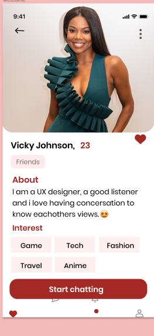
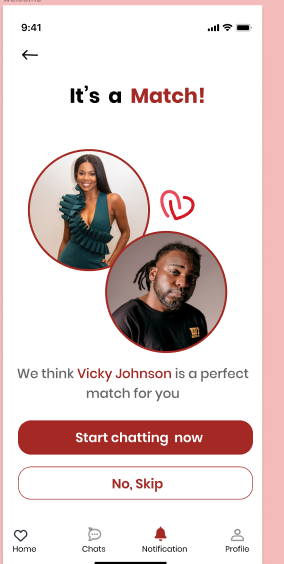
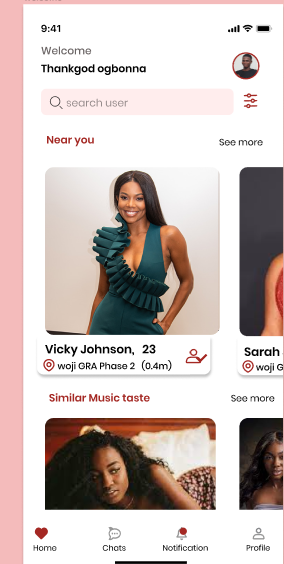
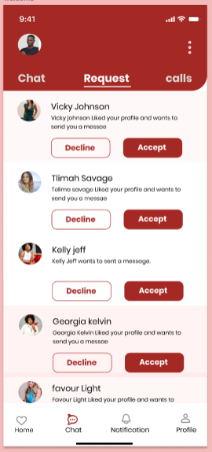

# Sparkz Dating App
### Under Development
### Project Directory

 - Project Directory
```shell
 app
 generated
 l10n
 localization
 src
 ```

 ### Screenshots
 
 

   

 <h5> The src folder contains all the necessary files for developing and maintaining the UI</h5>

 <h5>Inside the UI they are, two folders, shared and the views</h5>
 <h5>The shared folder contains UI tools, widgets, extensions and helpful strings</h5>
 <h5>The view folder contains all the app views such as Login View, Sign up View, Forgot Password View etc.</h5>
 
 <h5>The view folder are are seperated in two ways, which are, the Features folder, containing the app views after authentication e.g Home View, Chat View etc</h5>
 <h5>The other views are the views for the various means of authentication and each routing is handled by the GoRouter package, from the code a simple navigation as been customized to _navigationService.pushScreen(context, LoginScreen.route)</h5>

 ##### Build App
 You can build the app using the commands below

 for Android

 ```
 ## development: flutter build apk -t lib/main.dart --flavor dev

 ## production: flutter build apk -t lib/main.dart --flavor prod
```

for IOS

```
Coming Soon
```
 


#### Olawills Dating App with Flutter, Node JS, Express Js and Bloc for State management

<h5>This project is going to be a large and comprehensive with lots of features, bug fixings, and possible more addition of developers </h5>
<h5>This project will be using it's own backend service which i will be creating myself with tge help of node and express js</h5>
<h5> The project uses the MVVM pattern and Dependency injection (GetIt) to structure and organize all files and folders
<h5>By the end of this project i will be providing the screenshot and also a detailed view of each folders and codes</h5>

<h5>To enjoy Flutter utils stay follow me on my Linkedln and Twitter page which are <a href ="https://www.linkedln.com/in/olawills">Linkedln page</a> and <a href ="https://www.twitter.com/olawillfFlutter"> Twitter Page</a></h5>

